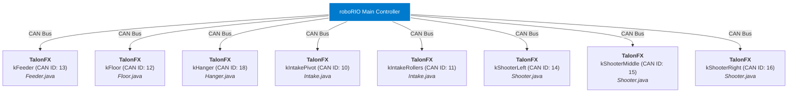

# FRC Hardware & Wiring Map

```mermaid
graph TD
    rio[roboRIO Main Controller]
    style rio fill:#007acc,stroke:#fff,stroke-width:2px,color:#fff
    dev_TalonFX_kFeeder["<b>TalonFX</b><br/>kFeeder (CAN ID: 13)<br/><i>Feeder.java</i>"]
    rio -->|CAN Bus| dev_TalonFX_kFeeder
    dev_TalonFX_kFloor["<b>TalonFX</b><br/>kFloor (CAN ID: 12)<br/><i>Floor.java</i>"]
    rio -->|CAN Bus| dev_TalonFX_kFloor
    dev_TalonFX_kHanger["<b>TalonFX</b><br/>kHanger (CAN ID: 18)<br/><i>Hanger.java</i>"]
    rio -->|CAN Bus| dev_TalonFX_kHanger
    dev_TalonFX_kIntakePivot["<b>TalonFX</b><br/>kIntakePivot (CAN ID: 10)<br/><i>Intake.java</i>"]
    rio -->|CAN Bus| dev_TalonFX_kIntakePivot
    dev_TalonFX_kIntakeRollers["<b>TalonFX</b><br/>kIntakeRollers (CAN ID: 11)<br/><i>Intake.java</i>"]
    rio -->|CAN Bus| dev_TalonFX_kIntakeRollers
    dev_TalonFX_kShooterLeft["<b>TalonFX</b><br/>kShooterLeft (CAN ID: 14)<br/><i>Shooter.java</i>"]
    rio -->|CAN Bus| dev_TalonFX_kShooterLeft
    dev_TalonFX_kShooterMiddle["<b>TalonFX</b><br/>kShooterMiddle (CAN ID: 15)<br/><i>Shooter.java</i>"]
    rio -->|CAN Bus| dev_TalonFX_kShooterMiddle
    dev_TalonFX_kShooterRight["<b>TalonFX</b><br/>kShooterRight (CAN ID: 16)<br/><i>Shooter.java</i>"]
    rio -->|CAN Bus| dev_TalonFX_kShooterRight
```
